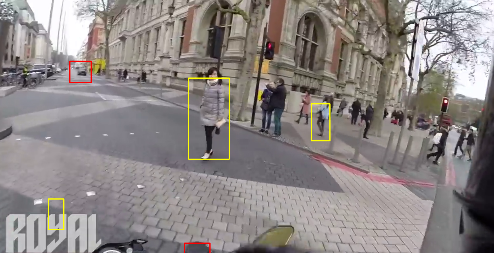

# AI Car and Pedestrian Tracker
This is just a basic AI tracker that can spot pedestrians and cars in a video by using OpenCV to study each frame of the video to see where a possible match for a car, or a possible match for a pedestrian might be. This is still a work in progress and is just a basic understanding of how OpenCV works when it comes to Car and Pedestrian Tracking.

## How to install
Make sure you have Python installed
```
python --version
```

Clone the repository into a folder of your choosing
```
git clone https://github.com/Blademaster680/AI-Car-and-Pedestrian-Tracker.git <directory>
```

Install all the dependancies
```
pip install -r requirements.txt
```

On Line 5 of Car_and_Pedestrian_Tracker.py you need to add your video directory
```
video = cv2.VideoCapture('<Name of video>.mp4')
```

Run the script and watch what happens
```
python Car_and_Pedestrian_Tracker.py
```

## Example Image

